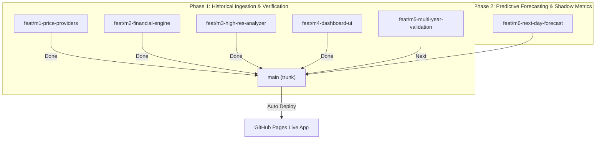
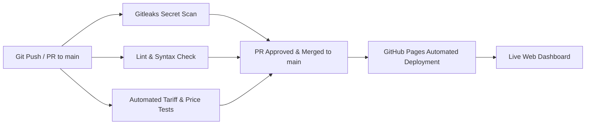

# Product Requirements Document (PRD): MySunshine

A comprehensive system to track, simulate, and calculate the actual financial return on investment (ROI) for a household solar panel and home battery system in Sweden (SE3), with future capabilities for solar forecasting, smart charging, and price arbitrage.

---

## 1. Objectives

### Core Objective (Phase 1: Multi-Year Historical ROI & Calculation Validation)
Calculate, verify, and validate the **true financial ROI and savings** of the solar and battery installation using real historical electricity price data (Nordpool SE3 / Tibber) and actual multi-year consumption/production logs (2021–2026).
- Ingest and cross-validate multi-year Sonnen data: **2023** (from September 11 kWh battery install), **2024** (full year with 11 kWh to 22 kWh expansion on Sep 9), **2025** (full year with dual 22 kWh battery), and **2026** (high-resolution hourly/quarterly logs).
- Quantify total savings against realistic 3-way baselines (No Solar/Battery, Solar-only).
- Isolate the **marginal financial contribution** of the SonnenBatterie 10 across both single-module (11 kWh) and dual-module (22 kWh) configurations.
- Account for Swedish electricity market specifics: spot prices (both hourly and 15-minute/quarterly), energy tax (*energiskatt*), grid fees (*nätavgift*), grid benefit (*nätnytta*), 25% VAT (*moms*), Tibber fees, and micro-production tax deduction (*skattereduktion* 60 öre/kWh).
- Ensure calculations, graphs, and energy balances are thoroughly validated and audited against actual utility bills before undertaking automated control.

### Future Objective (Phase 2: Predictive Forecasting & Shadow Recommendation Engine)
Postpone active battery hardware control until historical calculations and predictive models have been validated over time. Focus on predictive metrics and shadow evaluation:
- **Next-Day Cost & Savings Forecast**: Provide a forecast of expected electricity cost and savings for the coming day based on historical consumption patterns, tomorrow's published day-ahead spot prices, and local weather forecasts.
- **Dynamic Charging Recommendation Engine (Shadow Mode / Metrics Only)**: Produce recommendations for optimal grid pre-charging or dispatch without physically manipulating battery hardware.
- **Predictive vs. Actual Backtesting**: Automatically evaluate predictions the following day (e.g., *"The recommendation engine would have saved/lost X SEK compared to actual dispatch"*), measuring theoretical optimization upside against real-world performance.

---

## 2. System Hardware, Capex & Environmental Configuration

* **Bidding Zone**: **SE3** (Sweden - Stockholm / Central Sweden, Nordpool market).
* **Electricity Retailer (Elhandelsbolag)**: **Tibber** (`https://tibber.com/se`).
  * Price Model: Dynamic spot pricing.
  * **Pricing Resolution Transition Date**: **2025-10-01** (Switched from 60-min hourly prices to 15-min quarterly prices).
  * Fixed Subscription: 49 SEK / month (incl. moms).
* **Grid Operator (Elnätsbolag)**: **Eskilstuna Energi & Miljö (EEM)** (`https://eem.se`).
* **Solar PV System**:
  * Inverter: **SMA Inverter model STP8.0-3AV-40** (3-phase, 8.0 kW AC rating).
  * **Installation Date**: **January 2021** (Starting point of the investment).
  * **Solar Panels Net Capex**: ~**165,000 SEK** (Net out-of-pocket after *Grön Teknik* deduction; ~206,250 SEK gross).
* **Battery Storage**: **SonnenBatterie 10 performance**:
  * **Phase 1 Installation Date**: **September 2023** (11 kWh module).
  * **Phase 2 Expansion Date**: **September 9, 2024** (Additional 11 kWh module added -> Total ~22 kWh nominal / ~20 kWh usable).
  * **Total Battery Net Capex**: ~**150,000 SEK** (Net out-of-pocket after 50% *Grön Teknik* deduction; ~300,000 SEK gross).
  * Continuous Power: Up to 7.0–8.0 kW.
  * Observed Round-Trip Efficiency: ~76.7% – 77.0%.
* **Combined Investment Totals**:
  * **Total Net Capex (Actual Out-of-Pocket)**: ~**315,000 SEK** (165,000 SEK Solar Net + 150,000 SEK Battery Net).
  * **Gross Total System Cost (Pre-Subsidy)**: ~**506,250 SEK** (~206,250 SEK Solar Gross + ~300,000 SEK Battery Gross).
* **Historical Data Coverage**:
  * **2021–2023 (Aug)**: Solar Only period.
  * **2023 (Sep–Dec)**: 11 kWh SonnenBatterie 10 (`data/sonnen_energy_data_2023.csv`).
  * **2024 (Full Year)**: 11 kWh (Jan–Aug) transitioning to 22 kWh (Sep 9+) (`data/sonnen_energy_data_2024.csv`).
  * **2025 (Full Year)**: 22 kWh dual module full year (`data/sonnen_energy_data_2025.csv`).
  * **2026 (Recent High-Res)**: 30-day 15-min/hourly export (`data/sonnen_energy_data_Sun_Aug_16_2026.csv`).
* **Execution & Data Hub**:
  * Primary: **Home Assistant Green** (local polling, long-term statistics storage, automation hub).
  * Fallback / Analysis Host: Dedicated Ubuntu laptop running 24/7.
* **Network & Local Device Endpoints**:
  * Home Assistant Green: `192.168.3.138` (`http://ha.home`)
  * SonnenBatterie 10: `192.168.3.125` (`http://sonnen.home`)
  * SMA Inverter: `192.168.3.61` (`http://sma.home`)

---

## 3. Data Architecture & Integration Strategy

```mermaid
flowchart TD
    subgraph Data Sources
        sonnen[SonnenBatterie Local API / App Export]
        sma[SMA Inverter Webconnect / HA Integration]
        tibber[Tibber API / HA Tibber Integration]
        ha[Home Assistant Green History DB]
        price_apis[Modular Price Providers: Tibber / ENTSO-E / Elering / Energy-Charts]
    end

    subgraph Core Engine: MySunshine Analyzer
        ingest[Data Ingestion & Multi-Resolution Normalizer (15-min / Hourly / Daily)]
        price_mod[Price Matching & Swedish Tariff Engine (Tibber + EEM SE3)]
        baseline[3-Way Baseline Engine (No Solar vs. Solar Only vs. Solar+Battery)]
        roi_calc[ROI, Capex & Cash Flow Calculator]
    end

    subgraph Outputs
        ui[Interactive Dashboard & Charts]
        ha_sensor[HA Custom Sensors & Dispatch Advice (Phase 2)]
    end

    sonnen --> ingest
    sma --> ingest
    tibber --> ingest
    ha --> ingest
    price_apis --> price_mod
    ingest --> price_mod
    price_mod --> baseline
    baseline --> roi_calc
    roi_calc --> ui
    roi_calc --> ha_sensor
```

### A. Energy Data Ingestion & Resolution Matching

Because the electricity market transitioned from hourly to 15-minute prices on **2025-10-01**, the analyzer supports dynamic multi-resolution alignment:

1. **Pre-2025-10-01 Timeline (Hourly Market)**:
   * Market spot prices: Hourly (60 min).
   * Energy data: Ingested as hourly or mapped from daily aggregated totals.
2. **Post-2025-10-01 Timeline (15-Minute / Quarterly Market)**:
   * Market spot prices: 15-minute intervals (96 intervals/day).
   * **When Energy Data is Hourly (e.g. Sonnen 30-day export)**: The 4 quarterly prices within each hour are arithmetic/volume averaged for the hourly block, or synthetic quarter-hour disaggregation is applied.
   * **When Energy Data is 15-Minute (e.g. Tibber API / Home Assistant logs)**: Exact interval-by-interval multiplication for peak precision.
3. **Daily Aggregated Time-Series (2025 Historical Baseline)**:
   * Evaluated using synthetic diurnal load/generation profile weighting across the year.

### B. Modular Historical Electricity Price Engine

A pluggable adapter interface (`PriceProvider`) to fetch and cache historical SE3 spot prices with automatic fallback:

| Provider | Data Coverage | Granularity | Auth / API Key | Use Case |
| :--- | :--- | :--- | :--- | :--- |
| **Tibber API (GraphQL)** | Exact household prices & historical spot | 15-min (post-2025-10-01) & Hourly (pre-2025-10-01) | Free Personal Access Token | Direct retailer ground truth |
| **ENTSO-E Transparency Platform** | Official European TSO | Hourly & 15-min | Free API Token (via email) | Primary European official source |
| **Elering API** | Nordic & Baltic Bidding Zones | Hourly | None (Public REST) | Instant fallback & verification |
| **Energy-Charts API (Fraunhofer ISE)** | European Day-Ahead Spot | Hourly | None (Public REST) | Robust secondary fallback |
| **Local Cache / Static File Adapter** | User-supplied or pre-fetched | Any | Local file | Offline & rapid test execution |

### C. Configuration, Endpoints & Secrets Management

All external API endpoints, local hardware URLs, and private security tokens are managed via a local, git-ignored `.env` file:
* **External Price APIs**:
  * `ENTSOE_API_URL` & `ENTSOE_API_KEY`: ENTSO-E Transparency Platform endpoint & security token.
  * `TIBBER_API_URL` Tibber GraphQL endpoint. 
  * `TIBBER_API_TOKEN`: Tibber GraphQL token for these scopes:
    * tibber_graph
    * user
    * homes
    * price
    * consumption
  * `ELERING_API_URL`: Elering public spot price API endpoint.
  * `ENERGY_CHARTS_API_URL`: Fraunhofer Energy-Charts API endpoint.
* **Local Hardware & Hub Endpoints**:
  * `HA_URL` & `HA_TOKEN`: Home Assistant Green base URL and optional Long-Lived Access Token.
  * `SONNEN_URL` & `SONNEN_API_TOKEN`: SonnenBatterie 10 local API base URL & token.
  * `SMA_URL`: SMA Inverter Webconnect URL.
* A template [` .env.example `](file:///C:/Users/chris/.gemini/antigravity-ide/scratch/mysunshine/.env.example) is committed to version control to provide the full configuration schema.

---

## 4. Swedish Electricity Pricing & Tariff Model (Tibber + EEM / SE3)

To determine the true financial payoff, every kWh imported and exported is calculated using the Swedish market tariff structure:

### 1. Grid Import Cost Formula ($C_{\text{import}}$)
$$C_{\text{import}}(t) = \left( \text{SpotPrice}_{\text{SE3}}(t) + \text{TibberMarkup} + \text{Elcertifikat} + \text{Energiskatt} + \text{Överföringsavgift}_{\text{EEM}} \right) \times (1 + \text{Moms}_{25\%})$$
* **SpotPrice**: 15-minute quarterly or hourly spot price (öre/kWh).
* **Tibber Markup & Certificates**: Variable retailer cost component.
* **Energiskatt (Energy Tax)**: Government energy tax (~42.8–53.5 öre/kWh incl. VAT).
* **Överföringsavgift (EEM Grid Transfer Fee)**: Variable distribution fee from Eskilstuna Energi & Miljö.
* **Moms**: 25% Swedish Value Added Tax applied to all applicable components.
* **Fixed Monthly Costs**: Tibber base fee (49 SEK/mo) + EEM grid connection subscription (*säkringsavgift*).

### 2. Grid Export Revenue Formula ($R_{\text{export}}$)
$$R_{\text{export}}(t) = \text{SpotPrice}_{\text{SE3}}(t) + \text{Nätnytta}_{\text{EEM}} + \text{Skattereduktion}_{60\text{öre}}$$
* **SpotPrice**: Received spot price per exported kWh via Tibber.
* **Nätnytta (EEM Grid Benefit)**: Payment from EEM for localized micro-production grid relief (~5–10 öre/kWh, tax-free).
* **Skattereduktion (60 öre/kWh)**: Tax reduction for green micro-production (*skattereduktion för mikroproduktion av förnybar el*, inkomstskattelagen 67 kap). Active for 2025; configurable/toggleable for 2026+ calculations.

---

## 5. Feature & Visualization Requirements

### Phase 1: Historical ROI & Financial Analytics

#### 1. Core Financial Engine
* **3-Way Comparative Financial Baselines**:
  * **Baseline 1 (No Solar, No Battery)**: Simulates total electricity bill if 100% of household consumption had to be purchased from the grid.
  * **Baseline 2 (Solar Only, No Battery)**: Simulates the financial outcome if solar panels were installed without a battery (direct self-consumption capped at instant load, remainder exported).
  * **Actual (Solar + SonnenBatterie 10)**: Realized electricity bills and export revenues.
  * **Marginal Battery Value**: $\text{Savings}_{\text{Actual}} - \text{Savings}_{\text{Solar-Only}}$ to isolate the exact annual SEK contribution of the battery.
* **Capex & Investment Payback Tracking**:
  * Configurable Net Capex input (after Swedish *Grön Teknik* deduction: 20% solar, 50% battery).
  * Computes percentage of Capex recouped to date, remaining unrecovered balance, and dynamic break-even year.
* **Battery Health & Performance Diagnostics**:
  * Tracks real-world round-trip efficiency (observed ~76.7%–77.0%), annual cycle counts, and standby energy losses.

#### 2. Dashboard UI & Visualization Blueprint
The web interface will feature a modern dark-theme dashboard with interactive visualizations:

1. **Top-Level KPI Dashboard Cards**:
   * **Total Savings to Date (SEK)**: Cumulative financial gain compared to the "No Solar" baseline.
   * **Capex Recouped Progress Gauge / Card**: e.g., *"34.2% of Capex Recouped (112,400 / 328,000 SEK)"* with a radial progress ring.
   * **Payback Period Estimate**: Estimated years to break-even based on historical run-rate and energy inflation.
   * **Marginal Battery Contribution**: Extra SEK earned solely due to battery load shifting.
   * **Annual CO₂ Offset**: Kilograms/tonnes of carbon emissions avoided.

2. **Cumulative Cash Flow & Payback S-Curve (Chart 1)**:
   * Line chart starting below zero ($-\text{Capex}$) at Year 0 and ascending through time.
   * Shows historical actuals (solid green curve) transitioning into 25-year projections (dashed line).
   * Highlights the Break-Even point ($0 line intersection) with an interactive milestone marker.

3. **3-Way Baseline Monthly Comparison (Chart 2 - Stacked Bar)**:
   * Side-by-side monthly cost breakdown comparing:
     1. Bill without Solar/Battery (Grey)
     2. Bill with Solar Only (Amber)
     3. Actual Bill with Solar + Battery (Teal)
   * Visually reveals winter vs. summer savings dynamics.

4. **Hourly Dispatch & Price Heatmap (Chart 3 - Interactive Time-Series)**:
   * Dual-axis chart overlaying 15-min/hourly SE3 spot prices against battery state-of-charge (SoC), solar generation, and home load.
   * Visually highlights how the battery charges during cheap hours and discharges during peak price spikes.

5. **25-Year Detailed Financial Ledger Table**:
   * Year-by-year tabular view: Solar Gen, Self-Consumption, Exported kWh, Imported kWh, Raw Bill, Solar Bill, Annual Savings, and Net Cumulative Balance.

---

### Phase 2: Predictive Forecasting & Shadow Recommendation Engine

1. **Next-Day Cost & Savings Forecasting**:
   * Ingest day-ahead hourly/15-minute spot prices (published daily at ~13:00 CET by Nordpool/Tibber).
   * Integrate solar generation forecasts (via SMA Inverter data, Open-Meteo, or Forecast.Solar) and local weather forecasts (irradiance, temperature).
   * Project estimated household consumption profile and next-day electricity bill/savings against the "No Solar" baseline.

2. **Dynamic Grid Pre-Charging & Arbitrage Advisor (Shadow Mode / Metrics Only)**:
   * Evaluate tomorrow's price curve against predicted household load and forecasted solar generation.
   * Model whether pre-charging the battery during cheap night hours would yield positive financial return under the efficiency gate:
     $$\Delta \text{Price} > \frac{C_{\text{import}}}{\eta_{\text{roundtrip}}} - R_{\text{export}} + \text{LossMargin}$$
   * Output explicit actionable recommendations without actively controlling the hardware (e.g. *"Pre-charge 10 kWh between 02:00–05:00 at avg 18 öre/kWh to cover morning peak spike at 145 öre/kWh"*).

3. **Prediction vs. Actual Backtesting & Value Delta Tracking**:
   * Log daily recommendations and expected financial impact.
   * Compare projected outcomes against actual realized energy logs the next day.
   * Compute exact benchmark metric: *"The recommendation engine would have saved/lost X SEK compared to actual dispatch"*, verifying algorithm value before enabling physical control.

---

## 6. Implementation Roadmap & Verifiable Milestones

Development is organized around **Milestone Branches** (`feat/mX-...`) that merge into `main` via GitHub Pull Requests, with CI/CD automation:



### Milestone 1: Price Ingestion, Provider Module & CI Foundation (Completed)
* **Branch**: `feat/m1-price-providers`
* **Deliverables**: Pluggable `PriceProvider` interface, caching, Elering/ENTSO-E/Tibber providers, and CI with Gitleaks & Flake8.

### Milestone 2: 2025 Full-Year ROI & Baseline Engine (Completed)
* **Branch**: `feat/m2-financial-engine`
* **Deliverables**: Swedish tariff calculator (EEM fees, tax reduction, moms), 3-way baseline engine, Capex payback calculator, and CLI tool.

### Milestone 3: High-Resolution 30-Day & Multi-Resolution Engine (Completed)
* **Branch**: `feat/m3-high-res-analyzer`
* **Deliverables**: 744-hour high-res ingestion, multi-res matching (15-min to hourly), and daily-average estimation variance benchmarks.

### Milestone 4: Interactive Web Dashboard & GitHub Pages CD (Completed)
* **Branch**: `feat/m4-dashboard-ui`
* **Deliverables**: Modern dark-theme glassmorphic UI, 25-year calendar S-Curve (2021-2045), 3-way baseline bar chart, 24h dispatch overlay, static data baking pipeline, and automated GitHub Pages CD workflow (`.github/workflows/deploy.yml`).

### Milestone 5: Multi-Year Historical Expansion (2023–2025) & Calculation Validation
* **Branch**: `feat/m5-multi-year-validation`
* **Deliverables**:
  * `5.1 Multi-Year Sonnen CSV Ingestion`: Ingest `sonnen_energy_data_2023.csv` (Sep–Dec 2023) and `sonnen_energy_data_2024.csv` (Full Year 2024).
  * `5.2 Hardware Transition Modeling`:
    * Model Transition 1: Solar Only (Jan 2021 – Aug 2023).
    * Model Transition 2: 11 kWh SonnenBatterie 10 (Sep 2023 – Sep 8, 2024).
    * Model Transition 3: 22 kWh SonnenBatterie 10 Expansion (Sep 9, 2024 – Present).
  * `5.3 Historical Spot Price Ingestion & Matching`: Fetch and cache full 2023 and 2024 SE3 spot prices.
  * `5.4 Multi-Year Verification & Web Dashboard Integration`: Validate historical calculation integrity, verify monthly/annual savings, and add multi-year selector to the dashboard.
* **Verification Gate**:
  * Audited multi-year financial ledger showing exact energy balances and savings across 2023, 2024, and 2025; all pre-push checks pass.

### Milestone 6: Next-Day Forecasting & Shadow Recommendation Engine
* **Branch**: `feat/m6-next-day-forecast`
* **Deliverables**:
  * `6.1 Day-Ahead Price & Weather Ingestion`: Ingest tomorrow's published spot prices and local weather/solar irradiance forecast.
  * `6.2 Next-Day Cost & Savings Projection`: Model expected consumption and calculate tomorrow's projected bill and savings.
  * `6.3 Dynamic Charging Advisor (Shadow Mode)`: Generate pre-charging/dispatch advice without physical control.
  * `6.4 Prediction vs. Actual Backtesting`: Track and report predicted vs. actual delta (*"Engine would have saved/lost X SEK"*).
* **Verification Gate**:
  * Automated forecast pipeline and backtesting accuracy metrics report; CI tests pass.

### Phase 3 (Future): Home Assistant Custom Integration & Active Control
* **Deliverables**: Home Assistant custom sensors, long-term statistics entity, and optional automated battery dispatch after predictive model verification.

---

## 7. CI/CD & Automated Deployment Strategy (GitHub Actions)

Because the repository is hosted on a **public GitHub profile**, we establish an automated quality and security pipeline from Day 1:



### 1. Phased Pipeline Evolution Roadmap

| Pipeline Feature | Introduced In | Purpose |
| :--- | :--- | :--- |
| **Gitleaks Secret Leak Scan** | **Milestone 1** | Scans every PR/commit to ensure `.env` and tokens are never committed to public GitHub. |
| **Lint & Syntax Validation** | **Milestone 1** | Ensures code quality and consistent formatting. |
| **Price Provider & Cache Tests** | **Milestone 1** | Verifies spot price parsers and caching logic against mock responses. |
| **Tariff & Baseline Math Tests** | **Milestone 2** | Tests Swedish tax/fee equations and 3-way baseline logic against test vectors. |
| **Resolution Alignment Tests** | **Milestone 3** | Verifies hourly/quarterly timestamp synchronization. |
| **GitHub Pages Auto-Deployment (CD)** | **Milestone 4** | Automatically publishes the web app on merge to `main`. |

### 2. API Key Security & Zero Client-Side Secret Exposure Architecture

> [!CAUTION]
> **Strict Security Boundary**: Private API keys (`ENTSOE_API_KEY`, `TIBBER_API_TOKEN`, Home Assistant tokens) **must NEVER be shipped to, embedded in, or called directly from client-side JavaScript** deployed on public GitHub Pages.

1. **Build-Time / Local Data Pipeline (Static Data Baking)**:
   * Data fetching using authenticated APIs (ENTSO-E / Tibber) runs **strictly server-side** (locally on your machine or inside ephemeral GitHub Actions runners).
   * The pipeline processes and normalizes the historical price data into sanitized, static JSON data files (`data/prices/se3_prices_2025.json`).
   * The static web app on GitHub Pages merely loads these pre-computed JSON files. **No API tokens exist in the browser bundle or client network requests.**
2. **Zero-Auth Fallbacks for Client Runtime**:
   * If the browser needs live day-ahead spot prices at runtime without a backend server, it exclusively queries **unauthenticated public APIs** (such as Elering public REST or Energy-Charts) that do not require any secret tokens.
3. **GitHub Secrets for CI Automation**:
   * API tokens used in automated build or test workflows are stored as encrypted **GitHub Repository Secrets** (`Settings -> Secrets and variables -> Actions`). They are injected into ephemeral GitHub Actions runners during build time and are never exposed in build artifacts or public web pages.


