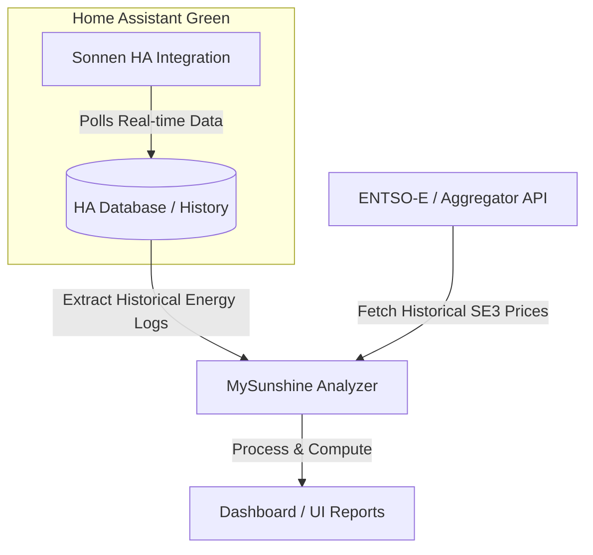

# Product Requirements Document (PRD): MySunshine

A system to track, simulate, and calculate the actual financial return on investment (ROI) for a household solar panel and home battery system, with future capabilities for smart charging and energy arbitrage.

---

## 1. Objectives

### Core Objective (Phase 1)

Calculate the **actual ROI** of the existing solar and battery installation using real historical electricity price data (Nordpool) and real consumption/production logs.

### Future Objective (Phase 2)

Implement smart battery control strategies, including:

* Charging the battery from the grid when electricity prices are low and solar generation is forecast to be low, and battery SoC (State of Charge) is below 50% or some other threshold that we calculate when we have more data.
* Arbitrage (buying low, discharging to avoid grid consumption or selling back when prices are high but only when SoC is > 50% or some other threshold that we calculate when we have more data).

---

## 2. System Architecture & Hardware

* **Solar Inverter**: SMA Inverter model STP8.0-3AV-40 (solar generation).
* **Battery Storage**: SonnenBatterie 10 performance with 4 modules (stores solar energy, charges/discharges, reports real-time power levels).
* **Bidding Zone**: **SE3** (Sweden - Stockholm zone, Nordpool market).
* **Execution Environment**: 
  * Primary: **Home Assistant Green** (as the hub for polling and historical storage).
  * Fallback/Secondary: **Dedicated Ubuntu laptop** running 24/7.

---

## 3. Data Integration Strategy

### IP addresses/DNS records

1. HA Green IP address: 192.168.3.138/ha.home
2. SonnenBattery IP address: 192.168.3.125/sonnen.home
3. SMA Inverter IP address: 192.168.3.61/sma.home

### A. Solar & Battery Logs (Sonnen & SMA)

* **Home Assistant Integration**: We will leverage the official/community Home Assistant integration for **sonnenBatterie** to pull real-time production, consumption, grid export/import, and battery state-of-charge (SoC). Here is the Home Assistant integration we have found https://github.com/mrpointblue/sonnenBatterie-Integration.
* **Option to create our own integration**: Here is the official API documentation for the SonnenBatterie:
    http://sonnen.home/api/doc.html. The OpenAPI spec is here blob:http://sonnen.home/cebf25a1-f125-4cc4-b1c8-bedb45aefcff. We have the option to allow our token to READ, WRITE, and use the Webhook API. We also have an SMA Inverter model STP8.0-3AV-40 solar generator. Here is the SMA integration we can use for HA: https://www.home-assistant.io/integrations/sma/
* **Historical Data Extraction**: Since the local Sonnen API doesn't support querying historical data, we will retrieve historical logs from the Home Assistant database or history API for the future. The historical data we can see in the Sonnen app can help us initially. It can be manually downloaded from the mobile app in two variants:
    * Power data in W
      * Discharge
      * Charge
      * Consumption
      * Production    
    * Energy data in kWh (this is probably what we need)
      * Discharge
      * Charge
      * Consumption
      * Production    
      * Feed-in
      * Grid purchase

Energy data from 2025 is in the file `data/sonnen_energy_data_2025.csv`

### B. Electricity Prices (Nordpool SE3)

* **Nordpool Prices**: Dynamic hourly spot prices for the **SE3 bidding zone**.
* **API Access**: We will use the **ENTSO-E Transparency Platform API** (requires a free registration) or a public aggregator like **Energy-Charts** or **Elering** to fetch historical day-ahead prices for SE3. An API key has been requested for ENTSO-E access, by using the instructions for the HA integration at https://github.com/yxkrage/hass-entso-e

---

## 4. Feature Requirements

### Phase 1: Historical ROI Calculator

1. **Dynamic Spot Price Matching**: Map every hour of historical household grid import and export to the corresponding SE3 spot price.
2. **Cost Saved by Solar/Battery**: Compute how much money was saved by:
   - Direct self-consumption of solar.
   - Charging the battery from solar and using it later (avoiding grid imports during peak price hours).
3. **Net Cash Flow Tracker**: Include fixed costs, feed-in tariffs, taxes, and solar export earnings to compute true net savings and playback progression.
4. **Interactive Dashboard**: A clean web interface showing cumulative savings, ROI, monthly/daily breakdown charts, and system efficiency.

### Phase 2: Smart Strategy Optimizer

1. **Solar Production Forecast**: Integrate solar forecasts (e.g., Forecast.Solar integration in HA). Note that the SMA Android app has a forecast feature which suggests that we may be able to get this from the inverter or its integration directly. The Sonnen API does not seem to provide this information. In addition, we need to consider how to use the forecast. For instance if the forecast is poor, should we consider turning on the consumption based charger to charge the battery from the grid, or would that be too expensive? We also need to forecast our consumption. When SoC is 100% the battery currently lasts around 24h on average. During winter time slightly less than during summer time.
2. **Dynamic Charging Scheduler**: Generate a recommendation engine showing when to force-charge the battery from the grid during low-price hours to prep for low-solar, high-price days. This is related to the previous point on how to use the forecast.

---

## 5. Next Steps for Next Session

1. **Home Assistant Setup**: Verify if the SonnenBatterie integration is active on the Home Assistant Green.
2. **Nordpool/ENTSO-E Token**: Assist the user in setting up free ENTSO-E API access if needed, or implement the aggregator fallback.
3. **Draft Implementation Plan**: Create the backend and frontend architecture for the analyzer tool.
