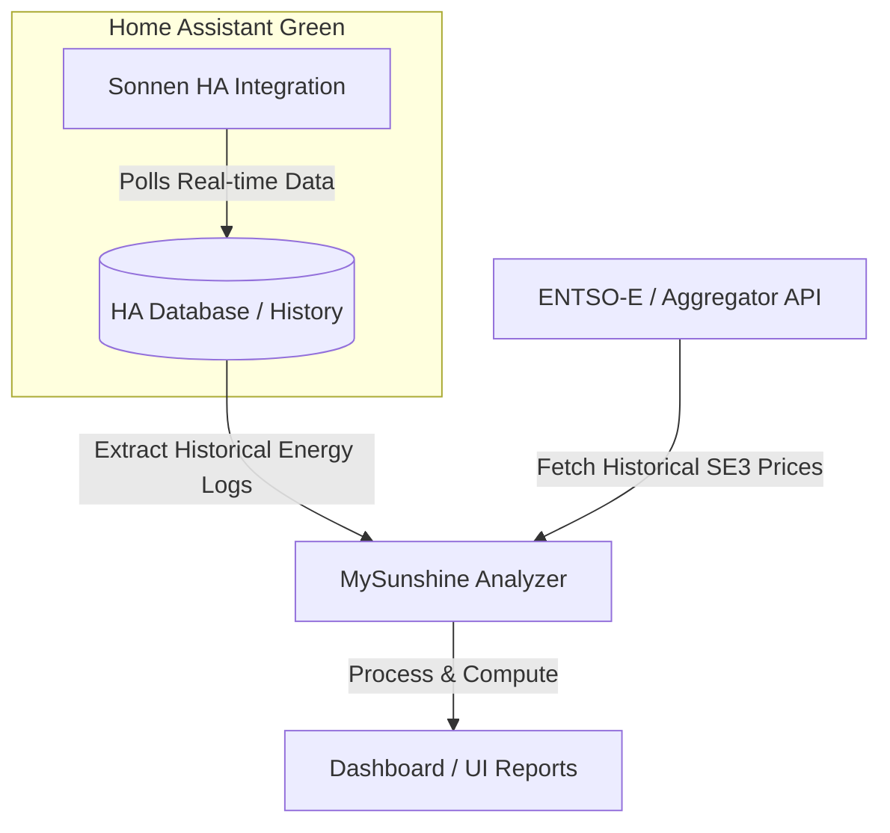

# Product Requirements Document (PRD): MySunshine

A system to track, simulate, and calculate the actual financial return on investment (ROI) for a household solar panel and home battery system, with future capabilities for smart charging and energy arbitrage.

---

## 1. Objectives

### Core Objective (Phase 1)
Calculate the **actual ROI** of the existing solar and battery installation using real historical electricity price data (Nordpool) and real consumption/production logs.

### Future Objective (Phase 2)
Implement smart battery control strategies, including:
* Charging the battery from the grid when electricity prices are low and solar generation is forecast to be low.
* Arbitrage (buying low, discharging to avoid grid consumption or selling back when prices are high).

---

## 2. System Architecture & Hardware

* **Solar Inverter**: SMA Inverter (solar generation).
* **Battery Storage**: SonnenBatterie (stores solar energy, charges/discharges, reports real-time power levels).
* **Bidding Zone**: **SE3** (Sweden - Stockholm zone, Nordpool market).
* **Execution Environment**: 
  * Primary: **Home Assistant Green** (as the hub for polling and historical storage).
  * Fallback/Secondary: **Dedicated Ubuntu laptop** running 24/7.

---

## 3. Data Integration Strategy

### A. Solar & Battery Logs (Sonnen & SMA)
* **Home Assistant Integration**: We will leverage the official/community Home Assistant integration for **sonnenBatterie** to pull real-time production, consumption, grid export/import, and battery state-of-charge (SoC).
* **Historical Data Extraction**: Since the local Sonnen API doesn't support querying historical data, we will retrieve historical logs from the Home Assistant database or history API.

### B. Electricity Prices (Nordpool SE3)
* **Nordpool Prices**: Dynamic hourly spot prices for the **SE3 bidding zone**.
* **API Access**: We will use the **ENTSO-E Transparency Platform API** (requires a free registration) or a public aggregator like **Energy-Charts** or **Elering** to fetch historical day-ahead prices for SE3.

---

## 4. Feature Requirements

### Phase 1: Historical ROI Calculator
1. **Dynamic Spot Price Matching**: Map every hour of historical household grid import and export to the corresponding SE3 spot price.
2. **Cost Saved by Solar/Battery**: Compute how much money was saved by:
   - Direct self-consumption of solar.
   - Charging the battery from solar and using it later (avoiding grid imports during peak price hours).
3. **Net Cash Flow Tracker**: Include fixed costs, feed-in tariffs, taxes, and solar export earnings to compute true net savings and playback progression.
4. **Interactive Dashboard**: A clean web interface showing cumulative savings, ROI, monthly/daily breakdown charts, and system efficiency.

### Phase 2: Smart Strategy Optimizer
1. **Solar Production Forecast**: Integrate solar forecasts (e.g., Forecast.Solar integration in HA).
2. **Dynamic Charging Scheduler**: Generate a recommendation engine showing when to force-charge the battery from the grid during low-price hours to prep for low-solar, high-price days.

---

## 5. Next Steps for Next Session
1. **Home Assistant Setup**: Verify if the SonnenBatterie integration is active on the Home Assistant Green.
2. **Nordpool/ENTSO-E Token**: Assist the user in setting up free ENTSO-E API access if needed, or implement the aggregator fallback.
3. **Draft Implementation Plan**: Create the backend and frontend architecture for the analyzer tool.
